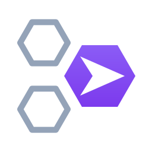

<p align="center">
  
</p>

# Fleetplane

**An agentless control plane for VM fleets, shipped as a single static binary.**

Fleetplane creates, reuses, and reclaims cloud resources — virtual machines, volumes, and other provider-backed kinds — on demand. Run it on a very small always-on VM and let it create larger pre-imaged machines when work arrives (for example Hetzner Cloud CI runners), reuse existing capacity before creating more, and delete idle capacity by policy. No agent runs on the managed machines: Fleetplane talks only to provider APIs.

Everything mutating flows through a crash-safe **operation journal**: kill the process mid-create, restart it, and recovery converges to exactly the fleet you asked for — no duplicates, no leaks. `examples/demo.sh` proves this live with a `kill -9`.

## What Fleetplane gives you

- **Pools** — declare "keep N machines of this class"; the reconciler holds the fleet at that size with a bounded mutation budget per cycle.
- **Acquisitions and leases** — `fleetplane acquire` binds you to an existing machine when capacity is free, or creates one when it is not; leases carry TTLs and idle machines are reclaimed by policy.
- **Cost-aware leasing** — providers declare billing windows (e.g. per-started-hour); Fleetplane reuses already-paid capacity, queues acquisitions to pack work into paid windows, and times deletions to land before billing boundaries ([design doc 11](docs/11_COST_AWARE_LEASING.md)).
- **Parked machines (the warm tier)** — where stopped machines bill at storage price (GCP, AWS), idle machines are parked instead of deleted and restarted in seconds instead of re-provisioned in minutes; the scheduler starts a parked machine before creating a new one ([design doc 12](docs/12_PARKED_MACHINES.md)).
- **Crash-safe operations** — every provider call is journaled first; the operation engine is the only retry authority, and ambiguous outcomes are verified rather than guessed ([ADR-014](docs/adr/ADR-014-retries.md), [ADR-017](docs/adr/ADR-017-operation-states.md)).
- **Multi-provider** — the same kernel drives Hetzner Cloud, DigitalOcean, AWS, and GCP (plus a deterministic fake provider); orchestration code never imports a cloud SDK (enforced mechanically).
- **Dynamic classes** — machine templates managed via API/CLI/dashboard or config, validated against the kind registry at definition time.

## Key features

- Single static Go binary: server, CLI, and web dashboard in one `fleetplane` executable
- Providers: **Hetzner Cloud**, **DigitalOcean**, **AWS**, **GCP**, **Docker** (containers as machines — real end-to-end tests with no cloud account), and a **fake** provider for local development and tests
- Generic resource kinds: `compute.machine` and `storage.volume` (the kind registry is open to more)
- Declarative apply: `fleetplane apply -f` with multi-doc YAML `Pool` and `Resource` manifests, compiled onto the same imperative API
- Web dashboard embedded in the binary, served at `/ui/` — no extra deployment, works offline
- Prometheus metrics on a separate loopback ops listener (`/metrics`), plus pprof and hot backup
- Static token auth with a closed permission set; secrets only ever referenced as `secret://` — never stored in config
- SQLite storage (WAL) with online backup via `VACUUM INTO`
- Discovery sweep: detects orphans and ghosts in the provider account and converges them safely

## Quickstart

No cloud account needed — the built-in `fake` provider behaves like a real one, including asynchronous creates.

Install a prebuilt binary (Linux/macOS; the script is [`install.sh`](install.sh) in this repo):

```bash
curl -fsSL https://raw.githubusercontent.com/samishal1998/fleetplane/main/install.sh | sh
```

Or build from source (requires Go 1.26+):

```bash
git clone https://github.com/samishal1998/fleetplane
cd fleetplane
go build -o fleetplane ./cmd/fleetplane
```

Write a minimal `config.yaml`:

```yaml
server:
  addr: ":8080"

storage:
  path: ./fleetplane.db

providers:
  demo:
    driver: fake
    settings:
      createSteps: 2

classes:
  demo-small:
    kind: compute.machine
    provider: demo
    spec:
      serverType: cpx31
      image: "snapshot:demo=v1"
```

Start the control plane:

```bash
./fleetplane serve --config config.yaml
```

In another shell, acquire capacity — a machine is created and bound:

```bash
./fleetplane acquire --class demo-small --cpu 1 --ttl 30m
# acq_01J...  -> res_01J...
# state: provisioning

./fleetplane watch acq_01J...     # polls until bound
./fleetplane resources            # ID  KIND  PROVIDER  PHASE  EXTERNAL  NAME
```

Acquire again and the **same** machine is reused; release when done:

```bash
./fleetplane release acq_01J...
```

Or declare a pool and let the reconciler hold it at size:

```bash
./fleetplane apply -f - <<'EOF'
apiVersion: fleetplane.io/v1alpha1
kind: Pool
metadata:
  name: demo-pool
spec:
  class: demo-small
  replicas: 2
EOF

./fleetplane pools
```

Open the dashboard at <http://127.0.0.1:8080/ui/> to see the fleet live.

For the full self-verifying tour (reuse, idle reclaim, and crash recovery under `kill -9`), run:

```bash
./examples/demo.sh
```

To go from here to a real cloud, follow the **[setup guide](SETUP_GUIDE.md)**.

## Architecture

```text
            fleetplane CLI ──HTTP──▶ ┌──────────────────────────────┐
            web dashboard ──/ui/──▶  │  API  (auth, idempotency)    │
                                     ├──────────────────────────────┤
                                     │  scheduler   pool reconciler │
                                     │        operation engine      │◀── crash-safe journal
                                     ├──────────────────────────────┤
                                     │  SQLite (WAL)                │
                                     └──────┬───────────┬───────────┘
                                     provider SDK   provider SDK
                                          │               │
                                  Hetzner / DO      AWS / GCP APIs
```

The kernel (API, scheduler, reconciler, operation engine, storage) is provider-agnostic: it journals intent, dispatches through a narrow provider SDK, and verifies outcomes. Providers are thin adapters; the boundary is enforced by `scripts/check-boundaries.sh` and depguard, so orchestration code can never import a cloud SDK. Depth lives in the design docs: [architecture](docs/02_ARCHITECTURE.md), [provider SDK](docs/03_PROVIDER_SDK.md), [API and resource model](docs/04_API_AND_RESOURCE_MODEL.md), [reconciliation and scheduling](docs/05_RECONCILIATION_AND_SCHEDULING.md).

## Documentation

| Document | What it covers |
|---|---|
| [Setup guide](SETUP_GUIDE.md) | Zero to production: install, config, tokens, systemd, provider walkthroughs |
| [Concepts](docs/guides/concepts.md) | Resources, classes, pools, acquisitions, operations, discovery |
| [Configuration](docs/guides/configuration.md) | Every config key, defaults, and validation rules |
| [CLI](docs/guides/cli.md) | The full `fleetplane` command tree and exit codes |
| [API](docs/guides/api.md) | HTTP routes, auth, idempotency, error shape |
| [Providers](docs/guides/providers.md) | Hetzner, DigitalOcean, AWS, GCP, and fake driver settings |
| [Operations](docs/guides/operations.md) | Running in production: metrics, backup, uncertain operations |
| [Dashboard](docs/guides/dashboard.md) | The embedded web UI |

Deeper background:

- Design docs: [`docs/`](docs/) (`00_README.md` … `12_PARKED_MACHINES.md`)
- Architecture decision records: [`docs/adr/`](docs/adr/)
- Runbooks: [backup and restore](docs/runbooks/backup-restore.md)
- OpenAPI contract: [`api/openapi.yaml`](api/openapi.yaml)

## Project status

Current release: **v0.2.0**. All phases of the [implementation plan](docs/09_IMPLEMENTATION_PLAN.md) are complete — generic resource kernel, provider SDK, Hetzner and DigitalOcean drivers, pools and reconciliation, acquisition scheduling, CLI/API hardening, production hardening (metrics, backup, chaos tests), and the `storage.volume` kind as the genericity proof. The API version is `fleetplane.io/v1alpha1`; expect additive evolution.

## Development

```bash
make gate    # build + vet + fmt-check + tidy-check + test(-race) + boundaries + lint
```

Every increment must end with `make gate` green ([ADR-009](docs/adr/ADR-009-boundaries.md)). Individual targets: `make build`, `make vet`, `make fmt-check`, `make tidy-check`, `make test` (runs `go test -race -shuffle=on -count=1 ./...`), `make boundaries`, `make lint` (and `make lint-install` for golangci-lint).

Test layout:

- Unit tests live beside their packages (`internal/...`, `pkg/...`, `providers/...`).
- Cross-cutting integration tests live in [`tests/`](tests/) (API, pools, acquisition, ownership, readiness, chaos, fault injection).
- End-to-end tests against a real Hetzner project are opt-in: set `FLEETPLANE_E2E=1` and `HETZNER_TOKEN` (dedicated throwaway project only — see [ADR-015](docs/adr/ADR-015-e2e-safety.md); all test resources are labeled and swept).
- Chaos tests are gated behind `FLEETPLANE_CHAOS=1` and print their seed for reproduction.

Kernel purity (orchestration code never imports provider SDKs) is enforced mechanically — see `.golangci.yml` (depguard) and `scripts/check-boundaries.sh`.
